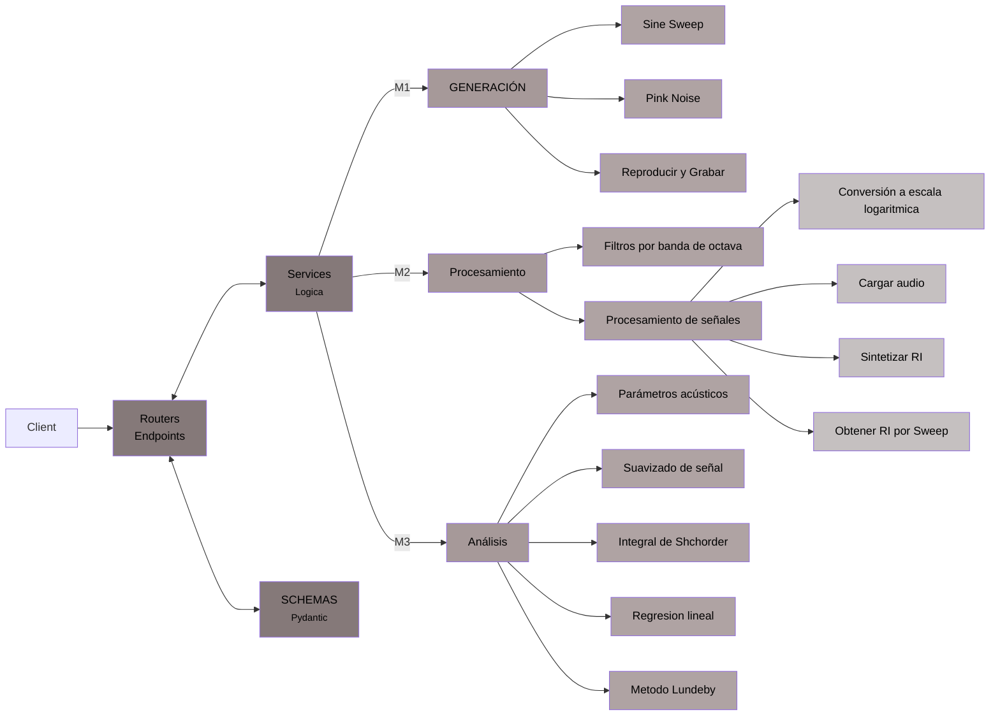

# RIR-API

API REST para procesamiento y analisis de respuestas al impulso segun la norma ISO 3382.

<!-- Badges -->


## Descripcion

RIR-API es un proyecto educativo que implementa una API REST (FastAPI) con una cadena
completa de procesamiento acustico: generacion de senales de excitacion, procesamiento
de respuestas al impulso por bandas de octava y calculo de parametros acusticos
(EDT, T20, T30) segun la norma [ISO 3382](https://www.iso.org/obp/ui/en/#iso:std:iso:3382:-1:ed-1:v1:en).


## Integrantes del grupo
 
  Dulcinea Bonet | Legajo: 81506. $${\color{magenta}Responsable \space de \space documentación}$$.

  Valentina De Piero | Legajo: 72221. $${\color{yellow}Responsable \space de \space procesamiento}$$.

  Federico Gionco | Legajo: 56901. $${\color{lightblue}Responsable \space de \space generacion \space de  \space senales}$$.

  Eugenia Onnainty | Legajo: 74462. $${\color{green}Responsable \space de \space testing/CI}$$.

## Librerias utilizadas
numpy | matplotlib | scipy | sounddevice | fastapi | pytest 
```bash
# En caso de no contar con alguno utilizar:
pip install numpy, matplotlib, scipy, sounddevice, fastapi, pytest
```

## Requisitos previos

- Python 3.12 o superior
- [uv](https://docs.astral.sh/uv/) (gestor de paquetes y entornos virtuales)
- [FastAPI](https://fastapi.tiangolo.com/) (framework a utilizar)
- [httpx](https://www.python-httpx.org/) (libreria para realizar requests)

## Instalacion

```bash
# Clonar el repositorio
git clone https://github.com/valentinadepiero/trabajo-practico-ss.git
cd trabajo-practico-ss

# Crear entorno virtual e instalar dependencias
uv sync

uv pip install -e ".[dev]"
uv add --dev httpx
uv add --dev fastapi
```

## Ejecucion

```bash
# Iniciar la API con hot-reload
uvicorn app.main:app --reload

# O usando el modulo directamente
python -m app.main
```

La API estara disponible en `http://localhost:8000`. Documentacion interactiva en:
- Swagger UI: `http://localhost:8000/docs`
- ReDoc: `http://localhost:8000/redoc`
## Diagrama de estructura


## Estructura del proyecto

```
rir-api/
├── .github/workflows                     # Integracion continua
|   └── ci.yml                            
├── app/
│   ├── __init__.py
│   ├── main.py                           # Punto de entrada FastAPI
│   ├── app.js                            # JSON
│   ├── routers/
|       ├── _pycache_
│       │   └── healt.cpython-313.pyc
│       ├── health.py                     # GET /health
│       └── __init__.py
│   ├── schemas/
│       └── ...                           # Modelos Pydantic de request/response
|   ├── _pycache_/
│   │   └── ...                           # cache
│   └── services/
│       ├── __init__.py
│       ├── acoustic_parameters.py        # Parametros acusticos ISO 3382 (M3)
│       ├── filter.py                     # Filtros de banda de octava (M2)
│       ├── pink_noise.py                 # Generacion de ruido rosa (M1)
│       ├── ploteo.py                     # Gráficos
│       ├── reproducir_grabar.py          # Funcion (M1)
│       ├── signal_utils.py               # Utilidades de procesamiento (M2)
│       └── sine_sweep.py                 # Generacion de sine sweep (M1)
├── tests/
│   ├── test_generacion.py                # Tests de generacion (M1)
│   ├── test_procesamiento.py             # Tests de procesamiento (M2)
│   ├── test_analisis.py                  # Tests de analisis (M3)
│   └── test_api.py                       # Tests de endpoints (M3)
├── docs/                                 # Documentacion
│   ├── M1
|       ├── medición01_ruido_rosa.png                           
|       ├── medición02_ruido_rosa.png   
|       ├── pink noise.png
│       └── sine sweep spectrogram.png 
│   ├── RI
|       ├── 1a_marble_hall.png                            
|       ├── 1a_marble_hall.wav                # https://www.openair.hosted.york.ac.uk/?page_id=459
|       ├── mh3_000_ortf_48k.png
|       └── mh3_000_ortf_48k.wav              # https://www.openair.hosted.york.ac.uk/?page_id=602
|   ├── feature
|       └── documentación         
│   ├── mediciones
│       └── sala_ejemplos.md
│   ├── teoria                            # Informacion adicional
│       ├── iso_3382.md
│       └── parametros.md  
│   └── README.md                         # Documentacion de RIR-API
├── .gitignore
├── AI_LOG.md                             # Documentacion sobre la utilzación de AI
├── README.md
├── pyproject.toml                        # Configuracion del proyecto
└── uv.lock
```
## Branching Strategy

La estrategia armada para el proyecto es utilizar tres tipos de branches. En primer lugar, MAIN donde estara la version estable del código. Luego TESTING donde se empleara como anteproyecto/borrador del código total. Por último, FEATURE donde realizaremos Branches segun las funcionalidades y conflictos que se generen a lo largo del proyecto, para seguidamente ser aprobados por el resto de los integrantes para enviarlos a TESTING y posteriormente al MAIN.

## Milestones

### M0 — Setup del entorno | Arquitectura (El plano) 
**Fecha:** Semana 5 (28 de abril de 2026)

- [x] Hacer fork del repositorio template.
- [x] Clonar el fork y verificar que el entorno se instala correctamente.
- [x] Ejecutar la API: `uvicorn app.main:app --reload`.
- [x] Verificar que `/health` responde correctamente.
- [x] Ejecutar los tests (todos deben fallar con `NotImplementedError` excepto los de API).
- [x] Verificar que el CI funciona en GitHub Actions.

### M1 — Generacion de senales
**Fecha:** Semana 8 (19 de mayo de 2026)

- [x] Implementar `generar_ruido_rosa()` en `app/services/pink_noise.py`.
- [x] Implementar `generar_sine_sweep()` en `app/services/sine_sweep.py`.
- [x] Implementar `reproducir_y_grabar()`.
- [x] Todos los tests de `test_generacion.py` deben pasar.

### M2 — Procesamiento de senales (RI)
**Fecha:** Semana 12 (16 de junio de 2026)

- [x] Implementar `cargar_audio()` en `app/services/signal_utils.py`.
- [x] Implementar `obtener_ri_desde_sweep()` en `app/services/signal_utils.py`.
- [x] Implementar `filtro_octava()` en `app/services/filter.py`.
- [x] Implementar `a_escala_log()` en `app/services/signal_utils.py`.
- [x] Implementar `sintetizar_ri()` para validacion.
- [x] Todos los tests de `test_procesamiento.py` deben pasar.

### M3 — API REST y analisis de parametros acusticos (Producto Final)
**Fecha:** Semana 15 (7 de Julio de 2026)

- [ ] Implementar `integral_schroeder()` en `app/services/acoustic_parameters.py`.
- [ ] Implementar `regresion_lineal()` en `app/services/acoustic_parameters.py`.
- [ ] Implementar `calcular_parametros_acusticos()` en `app/services/acoustic_parameters.py`.
- [ ] Crear routers y schemas para exponer toda la funcionalidad como API REST.
- [ ] Todos los tests de `test_analisis.py` y `test_api.py` deben pasar.
- [ ] (Opcional) Implementar `metodo_lundeby()`.

## Como correr los tests

```bash
# Ejecutar todos los tests
uv run pytest -v

# Ejecutar tests de un modulo especifico
uv run pytest tests/test_generacion.py -v

# Ejecutar tests de la API
uv run pytest tests/test_api.py -v

# Ejecutar tests con reporte de cobertura
uv run pytest --tb=short
```

## Como correr el linter

```bash
# Verificar estilo de codigo
uv run ruff check app/ tests/

# Corregir automaticamente lo que se pueda
uv run ruff check --fix app/ tests/

# Formatear el codigo
uv run ruff format app/ tests/
```

## Ejemplos con curl

```bash
# Obtener ruido rosa
curl -X POST http://localhost:8000/api/v1/signals/pink-noise \
  -H 'Content-Type: application/json' \
  -d '{"duracion": 1, "fs": 48000}' \
  -OJ

# Corregir automaticamente lo que se pueda
uv run ruff check --fix app/ tests/

# Formatear el codigo
uv run ruff format app/ tests/
```
## Licencia

Este proyecto esta licenciado bajo la Licencia MIT. Ver el archivo `LICENSE` para mas detalles.
