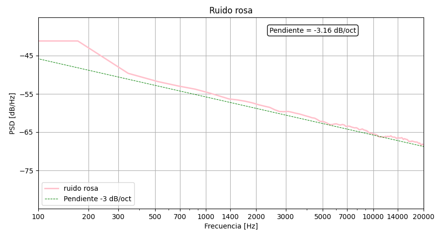
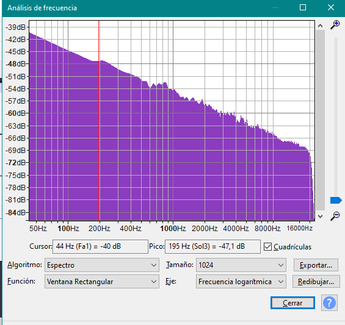
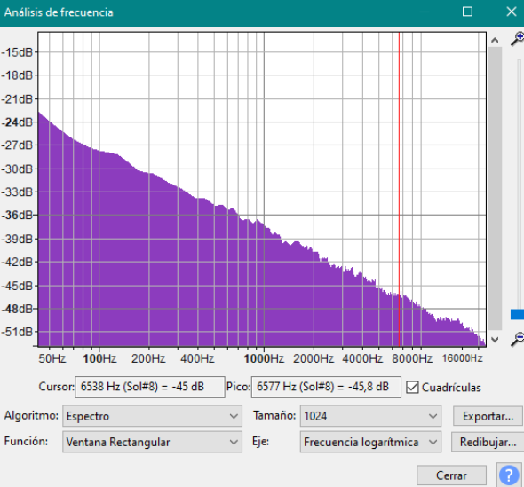
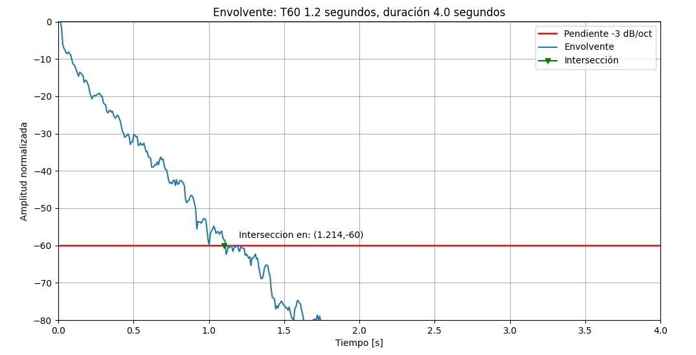
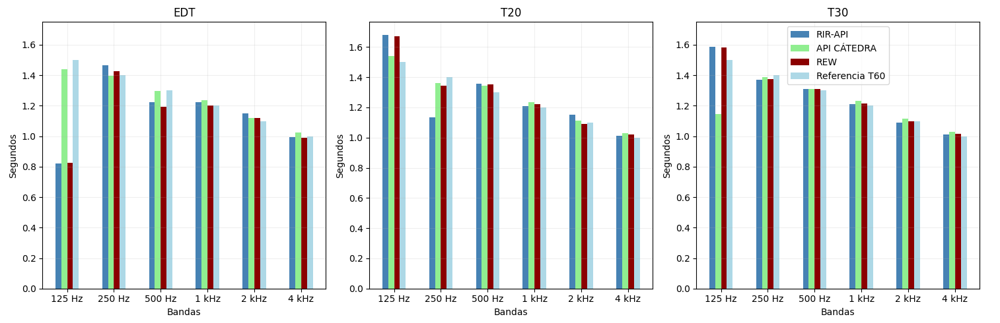
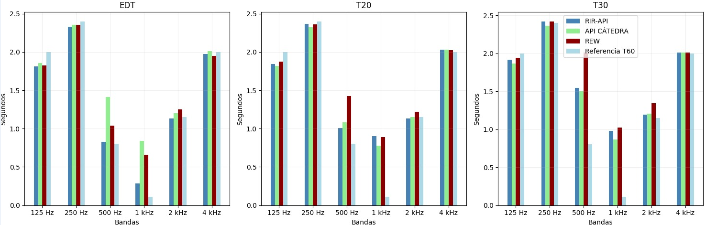
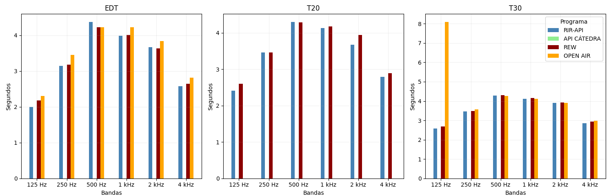
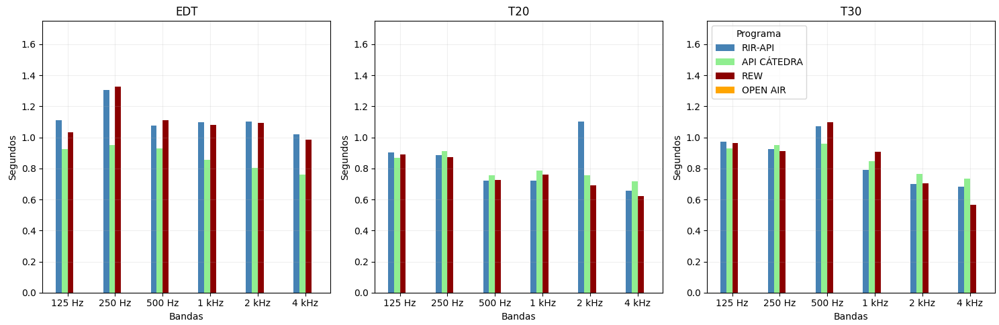
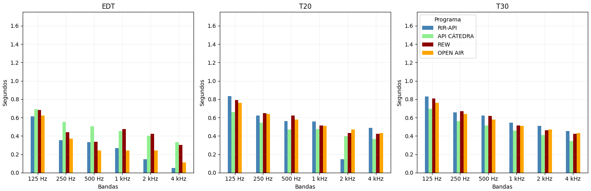

# Medición y Análisis de Parámetros Acústicos mediante una API REST (RIR-API)

**Materia:** Señales y Sistemas — UNTREF
**Trabajo Práctico:** RIR-API
**Integrantes:**
- Dulcinea Bonet (Legajo 81506) — Documentación
- Federico Gionco (Legajo 56901) — Generación de señales
- Eugenia Onnainty (Legajo 74462) — Testing / CI

**Fecha de entrega:** 7 de julio de 2026

---

## 1. Resumen

Este trabajo presenta el desarrollo de RIR-API, un sistema para la generación
de señales de excitación acústica, la obtención de respuestas al impulso (RI)
de recintos y el cálculo de parámetros acústicos normalizados según ISO 3382.
Se implementaron y validaron las etapas de generación de señales (ruido rosa
mediante el algoritmo de Voss-McCartney, barrido senoidal logarítmico con su
filtro inverso, y adquisición de audio), de procesamiento (carga de audio,
síntesis de respuestas al impulso de referencia, deconvolución mediante la
técnica de Farina, filtrado por bandas de octava según IEC 61260 y conversión
a escala logarítmica) y de análisis acústico final (EDT, T10, T20 y T30 por
banda de octava mediante la integral de Schroeder), obteniendo en todos los
casos resultados dentro de los criterios de aceptación definidos por la
cátedra (ver Sección 5). La validación de los parámetros acústicos se realizó
contra el software profesional REW, la API de la cátedra y valores de
referencia de OpenAIR para dos recintos reales, con diferencias
generalmente menores a 0,5 s salvo en las bandas más graves (125 Hz e
inferiores), donde la ausencia del algoritmo de Lundeby introduce mayor
incertidumbre (ver Sección 5.2).

---

## 2. Introducción

### 2.1 Contexto y motivación

La caracterización acústica de un recinto requiere medir cómo decae la
energía sonora en el tiempo luego de ser excitado por una fuente. Esta
información permite evaluar la calidad acústica de salas destinadas a
música, palabra u otros usos, y es la base de normas internacionales como
la ISO 3382, que estandariza los procedimientos de medición de parámetros
de reverberación en recintos comunes (International Organization for
Standardization [ISO], 2008).

### 2.2 Objetivos

- Generar señales de excitación acústica controladas (ruido rosa y barrido
  senoidal logarítmico) para ser reproducidas en un recinto.
- Obtener la respuesta al impulso (RI) de un recinto real a partir de una
  grabación, mediante la técnica de deconvolución de Farina (2000).
- Filtrar la RI en bandas de octava normalizadas (IEC 61260) y calcular los
  parámetros de reverberación EDT, T20 y T30 según el procedimiento
  establecido en ISO 3382.
- Exponer todo el pipeline de procesamiento como una API REST, validando
  los resultados contra un software de referencia profesional.

---

## 3. Marco teórico

### 3.1 Ruido rosa

El ruido rosa (también llamado ruido 1/f) es una señal aleatoria cuya
densidad espectral de potencia es inversamente proporcional a la
frecuencia, es decir, $S(f) = k/f$. En escala logarítmica esto equivale a
una caída constante de aproximadamente -3 dB por octava
($\Delta L = 10\log_{10}(1/2) \approx -3{,}01$ dB). Esta propiedad hace que
el ruido rosa contenga la misma energía por banda de octava, a diferencia
del ruido blanco (energía constante por Hz), y que sea percibido por el
oído humano de forma más pareja en todo el espectro audible, ya que reduce
relativamente la energía en las frecuencias altas. El fenómeno del ruido
1/f fue caracterizado originalmente en el contexto de la música y el habla
por Voss y Clarke (1978), quienes demostraron que las fluctuaciones de
tono e intensidad en señales musicales siguen naturalmente este
comportamiento espectral.

Para la generación práctica del ruido rosa se optó por el **algoritmo de
Voss-McCartney**, que construye la señal como la suma de múltiples
generadores de ruido blanco, cada uno actualizado a una tasa distinta
($2^i$ muestras): el generador de índice más bajo se actualiza con mayor
frecuencia que los de índices superiores, siguiendo el cambio de cada bit
del índice de muestra. La suma de estos generadores produce una señal cuyo
espectro se aproxima a $1/f$, sin necesidad de aplicar un filtrado
explícito en frecuencia.

### 3.2 Barrido senoidal logarítmico (sine sweep) y filtro inverso

Un barrido senoidal logarítmico es una señal cuya frecuencia instantánea
crece de forma exponencial en el tiempo, entre una frecuencia inicial
$f_1$ y una final $f_2$, a lo largo de una duración $T$:

$$x(t) = \sin\left[\frac{2\pi f_1 T}{\ln(f_2/f_1)}\left(e^{t \ln(f_2/f_1)/T} - 1\right)\right], \quad 0 \le t \le T$$

A diferencia de un barrido lineal, el barrido logarítmico distribuye la
misma cantidad de energía por octava de frecuencia, en lugar de por Hz —lo
cual resulta coherente con el análisis posterior por bandas de octava
(IEC 61260)—, a costa de concentrar más tiempo (y por lo tanto más
energía) en las frecuencias bajas. Farina (2000) formalizó el uso de este
tipo de señales para la medición de respuestas al impulso, junto con la
construcción de un **filtro inverso**: una versión temporalmente invertida
del propio sweep, corregida en amplitud para compensar esa distribución
no uniforme de energía, de modo que su convolución con la señal original
aproxima un impulso ideal: $x(t) * x_{\text{inv}}(t) \approx \delta(t)$.

### 3.3 Respuesta al impulso y deconvolución

Bajo la hipótesis de que un recinto se comporta como un sistema lineal e
invariante en el tiempo (LTI), su comportamiento acústico queda
completamente caracterizado por una única función: su **respuesta al
impulso** $h(t)$. Para cualquier señal de excitación $x(t)$, la señal
grabada en el recinto resulta de la convolución $y(t) = x(t) * h(t)$.

Dado que no es posible generar físicamente un impulso ideal (amplitud
infinita), Farina (2000) propuso obtener $h(t)$ de forma indirecta: se
excita el recinto con un barrido senoidal logarítmico $x(t)$, se graba la
respuesta $y(t)$, y se convoluciona el resultado con el filtro inverso
$x_{\text{inv}}(t)$ del mismo sweep:

$$y(t) * x_{\text{inv}}(t) = (x * h) * x_{\text{inv}} = h * (x * x_{\text{inv}}) \approx h(t) * \delta(t) = h(t)$$

Esta técnica, conocida como **método del sine sweep exponencial (ESS)**,
permite recuperar la respuesta al impulso de un recinto con una relación
señal-ruido considerablemente mejor que otros métodos clásicos, y es el
procedimiento adoptado en este trabajo.

### 3.4 Bandas de octava (IEC 61260)

El análisis de parámetros acústicos se realiza banda por banda, siguiendo
la norma IEC 61260, que define bandas de octava y fracciones de octava
para uso en electroacústica (International Electrotechnical Commission
[IEC], 2014). Para una frecuencia central $f_c$, los límites de la banda
se definen como $f_{\text{inf}} = f_c \cdot 2^{-1/2}$ y
$f_{\text{sup}} = f_c \cdot 2^{1/2}$, de modo que bandas contiguas se
cruzan a -3 dB respecto de su nivel máximo. El filtrado se implementó
mediante filtros Butterworth pasa-banda, caracterizados por una respuesta
plana en la banda de paso y una caída progresiva fuera de ella.

### 3.5 Integral de Schroeder y parámetros de reverberación (ISO 3382)

La curva de decaimiento de energía de una RI obtenida por grabación directa
resulta ruidosa. Schroeder (1965) propuso obtener una curva de decaimiento
suave integrando la energía de la RI desde el final hacia el inicio:

$$E[n] = \sum_{k=n}^{N-1} h^2[k]$$

Esta integral (conocida como **integral de Schroeder**) produce una curva
monótonamente decreciente sobre la cual se ajustan regresiones lineales
por mínimos cuadrados para estimar los tiempos de reverberación, que luego
se extrapolan a una caída de 60 dB. Siguiendo la norma ISO 3382-2 (ISO,
2008), se calculan tres parámetros por banda de octava:

- **EDT (Early Decay Time):** pendiente ajustada entre 0 y -10 dB,
  sensible a las primeras reflexiones y vinculada a la percepción
  subjetiva de la reverberación. Al considerar un tramo distinto al de
  T20/T30 (que comienzan a contar el decaimiento recién después de -5 dB),
  el EDT no necesariamente coincide con estos últimos.
- **T20:** pendiente ajustada entre -5 y -25 dB, extrapolada a -60 dB.
  Requiere menor rango dinámico limpio que T30.
- **T30:** pendiente ajustada entre -5 y -35 dB, extrapolada a -60 dB.
  Es el parámetro estándar reportado como tiempo de reverberación (T60).

---

## 4. Desarrollo

### 4.1 Arquitectura del sistema

El sistema se organiza en tres capas, siguiendo el template provisto por
la cátedra:

- **`routers/`**: reciben las solicitudes HTTP y delegan el procesamiento
  a la capa de servicios.
- **`services/`**: contienen las funciones puras de procesamiento de
  señales (generación, procesamiento, análisis), sin dependencias de
  HTTP, organizadas por milestone.
- **`schemas/`**: definen los modelos de entrada y salida (Pydantic) que
  validan y serializan los datos intercambiados por la API.

### 4.2 Generación de señales (Milestone 1)

#### 4.2.1 Ruido rosa

Se implementó `generar_ruido_rosa` utilizando el algoritmo de
Voss-McCartney (ver Sección 3.1), a partir de generadores de ruido blanco
de 16 bits que se combinan según la tasa de actualización de cada bit del
índice de muestra, devolviendo un array normalizado entre -1 y 1.

Durante la implementación surgió como principal dificultad la comprensión
del criterio de actualización de los generadores: los de índice más bajo
se actualizan con mayor frecuencia que los de índices superiores. Esta
duda se resolvió consultando con el cuerpo docente.



*Figura 1. Densidad espectral de potencia (PSD) del ruido rosa generado,
calculada mediante el método de Welch. Se midió una pendiente de -3,16
dB/octava, dentro del criterio de aceptación de -3 ± 1 dB/octava. Se
observa una meseta en las frecuencias más bajas (hasta aproximadamente
170 Hz), atribuible a la resolución limitada de la ventana de análisis
utilizada para el cálculo de la PSD en esa zona, y a que el algoritmo de
Voss-McCartney requiere más coeficientes para mantener precisión en las
frecuencias bajas — lo que suaviza la pendiente en ese tramo.*

#### 4.2.2 Barrido senoidal logarítmico (sine sweep)

Se implementó `generar_sine_sweep`, que devuelve el barrido logarítmico
junto con su filtro inverso. El filtro inverso se obtiene invirtiendo
temporalmente el sweep y aplicando una corrección de amplitud que
compensa la distribución no uniforme de energía por frecuencia propia del
barrido logarítmico (mayor concentración de energía en frecuencias
bajas). La convolución del sweep con su filtro inverso produce un impulso
aproximadamente ideal.


*Figura 2. Espectrograma del barrido logarítmico. El eje vertical
representa la frecuencia y el horizontal el tiempo; la intensidad de
color indica la energía. Se observa la trayectoria exponencial ascendente
característica del barrido, con mayor dispersión en frecuencias bajas
debido a la menor resolución frecuencial de la ventana de análisis en esa
zona. Durante la elaboración de este gráfico se debió reemplazar la
escala `plt.yscale("log")` por `plt.yscale("symlog")` en matplotlib, más
adecuada para representar rangos de valores muy amplios sin perder el
comportamiento cerca de cero.*


*Figura 3. Resultado de convolucionar el sweep con su filtro inverso: un
impulso con lóbulos laterales pequeños, atenuados de forma simétrica en
pocos milisegundos, con amplitud máxima normalizada (1) en t = 0 s. Se
validó el criterio de relación pico/piso ≥ 40 dB, obteniéndose un valor de
109,5 dB.*

#### 4.2.3 Adquisición de audio (grabación y reproducción)

Se implementó `reproducir_y_grabar`, verificada de forma conjunta con
`generar_ruido_rosa` mediante la siguiente prueba manual:

```python
from app.services.pink_noise import generar_ruido_rosa
from app.services.reproducir_grabar import reproducir_y_grabar

prueba = generar_ruido_rosa(3, 44100)
reproducir_y_grabar(prueba, 44100, 4)
```

Esto genera 3 segundos de ruido rosa a 44100 Hz y graba 4 segundos de
respuesta. La prueba se repitió diez veces a distintas intensidades
sonoras, utilizando un micrófono cardioide Noga Vintage Mic-2030 PX para
la captura, y analizando el resultado en Audacity (menú
*Analizar → Trazar espectro*).




*Figura 4. Espectro (nivel en dB vs. frecuencia en escala logarítmica) de
una de las grabaciones reales del ruido rosa reproducido y capturado con
el micrófono cardioide. Se observa una caída aproximadamente lineal a lo
largo del eje de frecuencias logarítmico, coherente con la pendiente
constante de -3 dB/octava esperada para el ruido rosa, lo que sugiere que
la cadena reproducción → acústica del recinto → captura por micrófono no
introdujo coloraciones relevantes dentro del rango medido. La principal
dificultad durante esta prueba fue detectar que, en una primera versión,
`reproducir_y_grabar` capturaba el audio directamente desde la salida de
la computadora en lugar de hacerlo a través del micrófono, lo que hubiese
invalidado la posterior obtención de la RI real del recinto; esto se
corrigió forzando la captura por el dispositivo de entrada configurado en
`sounddevice`.*

### 4.3 Procesamiento (Milestone 2)

#### 4.3.1 Carga de audio

Se implementó `cargar_audio`, restringida a archivos WAV y FLAC (con
error informativo ante cualquier otro formato), que normaliza la señal
al rango (-1, 1) para evitar distorsión en los gráficos posteriores.
Acepta señales de una o dos dimensiones (mono o estéreo); en el caso de
recibir una señal estéreo, se convierte a mono mediante `mean(axis=1)`.

#### 4.3.2 Síntesis de respuesta al impulso de referencia

Se implementó `sintetizar_ri`, que genera una respuesta al impulso
artificial a partir de valores de T60 configurados por banda de octava,
utilizada para validar el resto del pipeline antes de trabajar con RIs
reales. El procedimiento seguido fue:

1. Generar ruido blanco.
2. Filtrar en cada banda de octava (pasa-banda).
3. Normalizar cada banda filtrada por su RMS.
4. Multiplicar por una envolvente exponencial $e^{-\alpha t}$ para
   producir el decaimiento.
5. Sumar todas las bandas.
6. Normalizar el resultado final.

**Caso 1 — fc = 1000 Hz, duración = 4 s, fs = 44100 Hz, T60 = 1,2 s:**


*Figura 5. Forma de onda de la RI sintetizada (amplitud vs. tiempo). Se
observa el pico de amplitud máxima (normalizada a 1) en t = 0 s —la señal
directa—, seguido de las reflexiones primarias y secundarias, cuya
energía decrece rápidamente y de forma exponencial.*



*Figura 6. Envolvente de la RI sintetizada en escala logarítmica,
normalizada a RMS para observar la tendencia general de decaimiento. Se
obtiene una recta —lo que confirma el decaimiento exponencial esperado—
que cruza -60 dB en t ≈ 1,214 s, frente al T60 configurado de 1,2 s (error
≈ 1,17%), dentro del criterio de aceptación de ±10% (1,08–1,32 s). Durante
la elaboración de este gráfico surgió como dificultad que, al aplicar el
filtro de banda, la envolvente no se obtenía correctamente; se recurrió a
asistencia de IA para identificar y corregir el error en el código.*

**Caso 2 — fc = 1000 Hz, duración = 4 s, fs = 44100 Hz, T60 = 2,0 s
(caso de validación oficial de la spec):**


*Figura 7. Curva de decaimiento energético de la RI sintetizada. El punto
de cruce con -60 dB se ubica en t = 1,99 s, lo que representa un error de
0,70% respecto del T60 objetivo de 2,0 s — dentro del criterio de
aceptación (±10%).*

#### 4.3.3 Obtención de la RI mediante deconvolución del sweep

Se implementó `obtener_ri_desde_sweep`. Partiendo del sine sweep generado
en M1, se asume que el recinto se comporta como un sistema LTI, de modo
que la grabación resultante es $y(t) = h(t) * x(t)$. Dado que la
convolución del sweep con su filtro inverso produce un impulso
aproximadamente perfecto $x(t)$ * $x_{\text{inv}}(t)$ $\approx$ $\delta(t)$,
al convolucionar la grabación con el filtro inverso se recupera
directamente la respuesta al impulso del recinto (y(t) ≈ h(t)).

Un aspecto a resolver durante la implementación fue que la RI obtenida
por este método queda recortada en la información previa al pico máximo;
al comparar por correlación cruzada contra la RI sintetizada de
referencia, fue necesario alinear ambas señales eliminando los primeros
valores hasta el pico máximo de la RI sintetizada.


*Figura 8. Comparación entre la RI original (sintetizada, celeste) y la
RI recuperada mediante deconvolución (naranja). Se obtuvo una correlación
cruzada de 0,9955, superando el criterio de aceptación (> 0,9).*


*Figura 9. Detalle de la comparación anterior, sobre los primeros 100 ms.*

#### 4.3.4 Filtrado por bandas de octava

Se implementó `filtro_octava` según la norma IEC 61260, calculando las
frecuencias de corte inferior y superior como
$f_{c} \cdot 2^{\pm 1/2}$ para cada una de las 9 frecuencias centrales, e
implementando el filtrado mediante un filtro Butterworth (respuesta plana
en la banda de paso, con caída progresiva fuera de ella).


*Figura 10. Banco de 9 filtros de octava según IEC 61260. Se verifica
visualmente que bandas contiguas se cruzan a -3 dB, cumpliendo el
criterio de aceptación (fc: -3 dB ± 1 dB).*

#### 4.3.5 Conversión a escala logarítmica

Se implementó `a_escala_log`, verificada contra el criterio de que el
máximo de la señal resultante sea 0 dB y que una amplitud mitad
corresponda a -6 dB.


*Figura 11. Señal convertida a escala logarítmica (dB) a partir de su
representación lineal. Se verifica que el punto de máxima amplitud
coincide con 0 dB y que el punto donde la amplitud lineal se reduce a la
mitad corresponde a -6 dB, cumpliendo el criterio de aceptación de la
función. Al tratarse de una conversión punto a punto, la forma general de
la curva se conserva respecto de la señal lineal, pero comprimida en el
eje vertical, lo que permite apreciar con más detalle el comportamiento en
las zonas de baja amplitud (cola de la señal) que en la escala lineal
quedan visualmente aplastadas contra el cero.*

### 4.4 Análisis acústico y API (Milestone 3)

Se implementaron las siguientes funciones del pipeline final:

- **`suavizar_signal`**: se optó por la envolvente de Hilbert en lugar de
  un promedio móvil, ya que no requiere elegir un tamaño de ventana y
  preserva mejor la estructura temporal del decaimiento.
- **`integral_schroeder`**: calcula la curva de decaimiento energético
  mediante integración inversa (desde el final de la señal hacia el
  inicio), obteniendo una curva monótonamente decreciente sobre la cual
  se pueden ajustar rectas.
- **`regresion_lineal`**: mediante mínimos cuadrados, ajusta la recta que
  mejor se aproxima a los tramos utilizados para extrapolar T20, T30 y
  EDT.


*Figura 12. Integral de Schroeder (verde) con las rectas de regresión
utilizadas para extrapolar T20, T30 y EDT hasta -60 dB.*

- **`calcular_parametros_acusticos`**: combina las funciones anteriores
  para obtener EDT, T10, T20 y T30 por banda de octava. Dado que T10, T20
  y T30 comienzan a contabilizar el decaimiento recién después de los -5
  dB, mientras que el EDT se mide desde 0 dB, este último resulta más
  sensible a las reflexiones tempranas y no necesariamente coincide con
  los demás parámetros. El procedimiento seguido por la función es:

  1. Filtrar la RI por bandas de octava (`filtro_octava`).
  2. Suavizar cada banda mediante la envolvente de Hilbert (`suavizar_signal`).
  3. Integrar la energía con la integral de Schroeder (`integral_schroeder`).
  4. Ajustar una regresión lineal sobre cada tramo correspondiente (EDT: 0 a -10 dB; T20: -5 a -25 dB; T30: -5 a -35 dB).
  5. Extrapolar cada recta hasta -60 dB para obtener el tiempo de reverberación de cada parámetro.

  La función admite además un flag `sin_filtrar` que, en lugar de
  duplicar el pipeline, reutiliza el mismo cálculo sobre la señal completa
  sin pasar por `filtro_octava`, evitando reescribir la lógica de
  Schroeder y regresión para ese caso.

**Decisiones de diseño de la API:**

- **Filtrado por bandas (`/filters/band`):** dado que una respuesta HTTP
  solo puede devolver un archivo, se evaluaron tres alternativas (rutas +
  descarga individual, ZIP, o codificación base64) y se optó por devolver
  un archivo ZIP en memoria (`io.BytesIO`, sin escribir a disco), por ser
  *stateless* y más simple de desplegar en Render. La metadata
  (`sample_rate`, `num_samples`, `bandwidth`, `center_frequencies`) se
  expone mediante headers HTTP (`X-*`) en lugar del cuerpo de la
  respuesta, ya que este último es binario.
- **Sine sweep:** mediante un parámetro booleano se puede solicitar
  también el archivo del filtro inverso en la misma respuesta.
- **Parámetros acústicos:** se separó el cálculo en dos endpoints —
  `/acoustics/parameters/by-bands` (resultado por banda de octava) y
  `/acoustics/parameters` (señal completa, sin filtrar)— pero ambos
  reutilizan la misma función `calcular_parametros_acusticos` mediante el
  flag `sin_filtrar`, evitando duplicar el pipeline de Schroeder y
  regresión.
- **Estimación de ruido de fondo:** al no implementarse el algoritmo de
  Lundeby para esta entrega, se optó por un estimador simplificado de
  `estimated_noise_level` y `estimated_snr_db` a partir de la energía de
  la cola de la señal, documentado explícitamente como una aproximación y
  no como el método de Lundeby. El endpoint
  `/analysis/impulse-response/by-bands` reporta explícitamente
  `lundeby_applied: false` y `cutoff_time: null`. La SNR estimada permite
  igualmente dar una noción de la calidad de los parámetros obtenidos: a
  mayor SNR, más fieles resultan EDT/T20/T30 al comportamiento real de la
  sala.

---

## 5. Resultados

### 5.1 Validación de funciones — Milestones 1 y 2 (completo)

| Función | Criterio de aceptación | Resultado obtenido |
|---|---|---|
| `generar_ruido_rosa` | Pendiente PSD (Welch) de -3 ± 1 dB/octava | -3,16 dB/octava |
| `generar_sine_sweep` (sweep × inverso) | Relación pico/piso ≥ 40 dB | 109,5 dB |
| `sintetizar_ri` (T60 = 2,0 s @ 1 kHz) | T60 medido dentro de ±10% (1,8–2,2 s) | T60 medido ≈ 1,99 s (error 0,70%) |
| `sintetizar_ri` (T60 = 1,2 s @ 1 kHz) | T60 medido dentro de ±10% (1,08–1,32 s) | T60 medido ≈ 1,214 s (error 1,17%) |
| `obtener_ri_desde_sweep` | Correlación cruzada > 0,9 | 0,9955 |
| `filtro_octava` | Cruce entre bandas contiguas a -3 dB ± 1 dB | Verificado visualmente en el gráfico |
| `a_escala_log` | Máximo = 0 dB; amplitud mitad = -6 dB | Verificado: máximo = 0 dB; amplitud mitad = -6 dB |

### 5.2 Validación de parámetros acústicos — Milestone 3

Se comparó el desempeño de `calcular_parametros_acusticos` (EDT, T10, T20
y T30 por banda de octava) contra tres referencias distintas: la
[API de la cátedra](https://rir-api-frontend.onrender.com/), el software
profesional REW, y los valores de referencia publicados por
[OpenAIR](https://www.openair.hosted.york.ac.uk/) para RIs de recintos
reales. Se estableció como criterio de aceptación una tolerancia de ±0,5 s
respecto del software profesional y/o de la API de la cátedra, tal como
exige la especificación de M3.

Se utilizaron seis señales: dos RI sintéticas generadas con
`sintetizar_ri` (con T60 tabulado conocido por banda) y cuatro RI reales
de OpenAIR correspondientes a dos recintos —**Maes Howe** (Orkney,
Escocia) y **Elveden Hall** (Suffolk, Inglaterra), este último con dos
grabaciones distintas—, evaluadas en seis bandas de octava normalizadas
(125, 250, 500, 1000, 2000 y 4000 Hz).

**Análisis de las RI sintéticas:** para ambas señales sintetizadas, los
valores de EDT, T20 y T30 obtenidos con la RIR-API resultaron muy
próximos a los del REW, con diferencias generalmente menores a 0,5 s. En
la primera RI sintética la única banda donde la API de la cátedra superó
a la RIR-API en precisión fue el T20 de 250 Hz. En la segunda, las
mayores discrepancias se concentraron en la banda de 500 Hz (EDT, T20 y
T30), aunque siempre dentro del margen aceptado; esto es consistente con
que dicha banda queda cerca del límite entre el suavizado de Hilbert y la
resolución del filtro de octava, lo que introduce mayor variabilidad en
la pendiente estimada por regresión.



*Figura 13. Comparación de EDT, T20 y T30 para la primera RI sintetizada.
En azul la RIR-API, en verde la API de la cátedra, en bordó el REW y en
celeste el T60 tabulado usado para generar el archivo.*



*Figura 14. Comparación de EDT, T20 y T30 para la segunda RI sintetizada,
con las mismas referencias que la Figura 13.*

**Análisis de las RI reales (OpenAIR):** en Elveden Hall (RI
`1a_marble_hall.wav`), los resultados fueron consistentes con el REW en
casi todas las bandas, salvo el T30 de 125 Hz, donde OpenAIR reporta un
valor con más de 5 segundos de diferencia respecto de la RIR-API; dado
que el REW obtuvo un resultado similar al nuestro en esa misma banda, se
interpreta que la discrepancia se debe a que no se contemplaron las dos
primeras bandas de octava (31,25 Hz y 62,5 Hz), donde el T30 alcanza
valores extremos (40,51 s y 22,68 s respectivamente) que probablemente
distorsionan el valor de referencia de OpenAIR para esa sala. En la
segunda grabación de Elveden Hall (`3a_hats_cloacks_the_lord.wav`, sin
dato de referencia en OpenAIR), los valores fueron consistentes con el
REW salvo en el T20 de 2000 Hz, con una diferencia menor a 0,5 s. En Maes
Howe (`mh3_000_wx_48k.wav`), al tratarse de una sala con tiempos de
reverberación bajos, ningún valor difirió del REW en más de 0,5 s, y en
varias bandas la RIR-API resultó incluso más cercana a la referencia de
OpenAIR que el resto de los programas comparados.



*Figura 15. Comparación de EDT, T20 y T30 para la primera grabación de
Elveden Hall (`1a_marble_hall.wav`). En azul la RIR-API, en bordó el REW
y en amarillo los datos de referencia de OpenAIR.*



*Figura 16. Comparación de EDT, T20 y T30 para la segunda grabación de
Elveden Hall (`3a_hats_cloacks_the_lord.wav`). En azul la RIR-API, en
verde la API de la cátedra y en bordó el REW; no hay dato de referencia
de OpenAIR para esta grabación.*



*Figura 17. Comparación de EDT, T20 y T30 para Maes Howe
(`mh3_000_wx_48k.wav`). En azul la RIR-API, en verde la API de la
cátedra, en bordó el REW y en amarillo los datos de referencia de
OpenAIR.*

En síntesis, el comportamiento observado en los cuatro gráficos de
comparación muestra que la mayor fuente de discrepancia entre
herramientas se concentra en las bandas de graves (125 Hz e inferiores),
donde los tiempos de reverberación son más largos y más sensibles al
ruido de fondo capturado en la grabación —lo cual es coherente con la
limitación conocida de no haber implementado el algoritmo de Lundeby para
esta entrega (ver Sección 4.4)—, mientras que en frecuencias medias y
altas la concordancia entre la RIR-API, la API de la cátedra y el REW es
sistemáticamente buena.

**Cuadro comparativo — Maes Howe:**

OpenAIR reporta su T60 de referencia utilizando únicamente el método T30
(regresión entre -5 dB y -35 dB), sin valores publicados de T20 ni T10.
La diferencia porcentual se calcula tomando como referencia el valor de
OpenAIR: $\text{Diferencia \%} = \frac{\text{RIR API} - \text{OPEN AIR}}{\text{OPEN AIR}} \times 100$.

| Parámetro | Fuente / Cálculo | 125 Hz | 250 Hz | 500 Hz | 1 kHz | 2 kHz | 4 kHz |
| :--- | :--- | :---: | :---: | :---: | :---: | :---: | :---: |
| **EDT** *(s)* | RIR API | 0,612 | 0,352 | 0,332 | 0,265 | 0,505 | 0,051 |
| | OPEN AIR | 0,620 | 0,370 | 0,240 | 0,240 | 0,240 | 0,110 |
| | **Diferencia %** | **-1,29%** | **-4,86%** | **+38,33%** | **+10,42%** | **+110,42%** | **-53,64%** |
| **T30** *(s)* | RIR API | 0,828 | 0,658 | 0,622 | 0,542 | 0,509 | 0,455 |
| | OPEN AIR | 0,760 | 0,640 | 0,580 | 0,510 | 0,470 | 0,430 |
| | **Diferencia %** | **+8,95%** | **+2,81%** | **+7,24%** | **+6,27%** | **+8,30%** | **+5,81%** |
| **T20** *(s)* | RIR API | 0,834 | 0,624 | 0,563 | 0,559 | 0,505 | 0,489 |
| | OPEN AIR | *N/A* | *N/A* | *N/A* | *N/A* | *N/A* | *N/A* |
| **T10** *(s)* | RIR API | 0,830 | 0,561 | 0,421 | 0,609 | 0,505 | 0,672 |
| | OPEN AIR | *N/A* | *N/A* | *N/A* | *N/A* | *N/A* | *N/A* |

*Conclusión — Maes Howe:* el T30 (el único parámetro con referencia
directa de OpenAIR) se mantiene siempre dentro de ±0,5 s, con diferencias
porcentuales acotadas entre 2,8% y 9%. El EDT, en cambio, muestra
diferencias porcentuales grandes en 500 Hz, 1 kHz y 2 kHz; esto se explica
por tratarse de un parámetro medido sobre un tramo muy corto (0 a -10 dB)
y en una sala de reverberación baja, donde pequeñas diferencias absolutas
(décimas de segundo) se traducen en variaciones porcentuales muy grandes,
sin que esto implique un error absoluto relevante.

**Cuadro comparativo — Elveden Hall (Suffolk, Inglaterra):**

| Parámetro | Fuente / Cálculo | 125 Hz | 250 Hz | 500 Hz | 1 kHz | 2 kHz | 4 kHz |
| :--- | :--- | :---: | :---: | :---: | :---: | :---: | :---: |
| **EDT** *(s)* | RIR API | 2,000 | 3,145 | 4,377 | 3,991 | 3,902 | 2,573 |
| | OPEN AIR | 2,300 | 3,450 | 4,220 | 4,220 | 3,840 | 2,810 |
| | **Diferencia %** | **-13,04%** | **-8,84%** | **+3,72%** | **-5,43%** | **+1,61%** | **-8,43%** |
| **T30** *(s)* | RIR API | 2,573 | 3,466 | 4,276 | 4,115 | 3,908 | 2,857 |
| | OPEN AIR | 8,100 | 3,580 | 4,260 | 4,110 | 3,910 | 2,990 |
| | **Diferencia %** | **-68,23%** | **-3,18%** | **+0,38%** | **+0,12%** | **-0,05%** | **-4,45%** |
| **T20** *(s)* | RIR API | 2,405 | 3,456 | 4,302 | 4,131 | 3,902 | 2,786 |
| | OPEN AIR | *N/A* | *N/A* | *N/A* | *N/A* | *N/A* | *N/A* |
| **T10** *(s)* | RIR API | 2,095 | 3,682 | 4,210 | 4,099 | 3,902 | 2,755 |
| | OPEN AIR | *N/A* | *N/A* | *N/A* | *N/A* | *N/A* | *N/A* |

*Conclusión — Elveden Hall:* a excepción de la banda de 125 Hz, todos los
parámetros muestran una concordancia excelente con OpenAIR (diferencias
porcentuales menores al 9%). La banda de 125 Hz es la única que excede
ampliamente el criterio de aceptación (T30 con -68,23% de diferencia); tal
como se discutió más arriba, esto se atribuye a que el cálculo no
incorporó las bandas de 31,25 Hz y 62,5 Hz —donde el T30 medido es
extremadamente alto (>20 s)— y que probablemente influyen en el valor
tabulado por OpenAIR para 125 Hz, en una sala con reverberación muy
prolongada donde el rango dinámico disponible en la grabación limita la
precisión de la regresión en frecuencias tan bajas.

---

## 6. Conclusiones

### 6.1 Dificultades técnicas encontradas

- **Generación de ruido rosa:** la principal dificultad conceptual fue
  entender el criterio de actualización de los generadores de ruido
  blanco en el algoritmo de Voss-McCartney (por qué los de índice bajo se
  actualizan con mayor frecuencia).
- **Visualización del espectrograma del sweep:** la escala logarítmica
  estándar de matplotlib no representaba adecuadamente el rango de
  valores del espectrograma; se resolvió utilizando `symlog` en lugar de
  `log`.
- **Captura por micrófono:** en una primera versión, `reproducir_y_grabar`
  capturaba el audio desde la salida de la computadora en lugar de
  hacerlo a través del micrófono, lo que invalidaba la obtención de la RI
  real del recinto.
- **Alineación temporal en la deconvolución:** la RI obtenida mediante
  `obtener_ri_desde_sweep` queda recortada en las muestras previas al
  pico máximo, lo que requirió alinear manualmente ambas señales antes de
  calcular la correlación cruzada contra la RI de referencia.
- **Envolvente de la RI sintetizada:** al aplicar el filtro de banda no
  se obtenía el gráfico esperado de la envolvente; fue necesario revisar
  el código con asistencia de IA para identificar el error.
- **Estimación de ruido de fondo sin Lundeby:** no implementar el
  algoritmo de Lundeby introdujo una limitación conocida en el cálculo de
  parámetros en bandas graves con reverberación muy prolongada (ver
  bandas de 125 Hz en la Sección 5.2); se optó por reportarlo
  explícitamente (`lundeby_applied: false`) en lugar de ocultar la
  limitación, y por acompañar los resultados con una SNR estimada que da
  una noción de su confiabilidad.
- **Unificación de `sintetizar_ri` y `filtro_octava`:** ambas funciones
  reimplementaban el diseño del filtro de banda por separado; se
  refactorizó `sintetizar_ri` para que reutilice `filtro_octava` como
  única implementación, eliminando la duplicación de la validación de
  banda.

### 6.2 Uso de herramientas de inteligencia artificial

A lo largo del trabajo se utilizaron distintos modelos (ChatGPT, GitHub
Copilot y Claude) de forma complementaria: ChatGPT y Claude se emplearon
principalmente para discutir alternativas de diseño, resolver errores
puntuales y estructurar tests (por ejemplo, la validación del T60 por
Schroeder, la correlación cruzada de `obtener_ri_desde_sweep`, los tests
de `filtro_octava` y la refactorización de `signal_utils.py`), mientras
que el autocompletado de Copilot se usó para redactar docstrings y
comentarios y para las funciones *fix* y *explain* ante errores de
código. El detalle completo de prompts, usos y resultados por milestone
se encuentra documentado en `AI_LOG.md`.

Como reflexión general del equipo, la IA fue más valiosa como
herramienta de *comprensión* que de *generación directa*: el diseño
preliminar de funciones ayudó a entender el propósito de funciones
específicas de librerías como NumPy o `sounddevice`, pero el código
resultante siempre se revisó y adaptó manualmente a los criterios de
diseño del equipo. En M3 en particular, se valoró la utilidad de
consultar alternativas de diseño antes de implementar —por ejemplo, para
decidir el formato de respuesta del endpoint de bandas (ZIP vs. rutas vs.
base64) o para resolver cómo reportar la estimación de ruido de fondo sin
haber implementado Lundeby— por sobre pedir directamente el código
completo, ya que esto permitió tomar decisiones de diseño propias en
lugar de heredar las de un modelo.

---

## Referencias

Farina, A. (2000, febrero). *Simultaneous measurement of impulse response
and distortion with a swept-sine technique* [Ponencia]. 108th Audio
Engineering Society Convention, París, Francia.

International Electrotechnical Commission. (2014). *Electroacoustics —
Octave-band and fractional-octave-band filters — Part 1: Specifications*
(IEC 61260-1:2014).

International Organization for Standardization. (2008). *Acoustics —
Measurement of room acoustic parameters — Part 2: Reverberation time in
ordinary rooms* (ISO 3382-2:2008).

Open Acoustic Impulse Response (OpenAIR) Library. (n.d.). *Maes Howe* y
*Elveden Hall* [Conjuntos de datos de respuestas al impulso].
Universidad de York. https://www.openair.hosted.york.ac.uk/

Schroeder, M. R. (1965). New method of measuring reverberation time. *The
Journal of the Acoustical Society of America, 37*(3), 409–412.
https://doi.org/10.1121/1.1909343

Voss, R. F., & Clarke, J. (1978). "1/f noise" in music: Music from 1/f
noise. *The Journal of the Acoustical Society of America, 63*(1), 258–263.
https://doi.org/10.1121/1.381721
